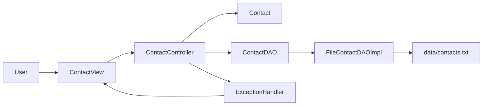

# Contact App - Exceptions Workshop

This is my Java workshop project for managing contacts in a text file. The
project practises validation, checked exceptions, try-with-resources, file I/O,
and the Model-View-Controller pattern.

## Current progress

I have completed the implementation through:

- **1: The Model & Validation (Unchecked)**
- **2: Custom Exceptions (Checked)**
- **3: The Data Layer (DAO)**
- **4: The View & Controller (MVC)**

The application can add contacts, list all contacts, search by name, and keep
the contacts between runs in `data/contacts.txt`.

## Design

I used the suggested package structure under the base package
`se.lexicon.contactapp`:

```text
src/main/java/se/lexicon/contactapp/
|-- Main.java
|-- controller/
|   `-- ContactController.java
|-- data/
|   |-- ContactDAO.java
|   `-- FileContactDAOImpl.java
|-- exception/
|   |-- ContactStorageException.java
|   |-- DuplicateContactException.java
|   `-- ExceptionHandler.java
|-- model/
|   `-- Contact.java
`-- view/
    `-- ContactView.java
```



### Model and validation

`Contact` contains a name and phone number. The constructor uses the setters so
the same validation is used when a contact is created or changed.

- The name cannot be null or blank and is stored without surrounding spaces.
- The phone number must match `^\d{10}$`, meaning exactly ten digits.
- Invalid values throw `IllegalArgumentException`, which is unchecked.

### Data layer

`ContactDAO` defines the persistence operations without deciding how contacts
are stored. `FileContactDAOImpl` implements the interface using a UTF-8 text
file.

- `findAll()` reads and returns every contact.
- `save()` checks for duplicate names and phone numbers before appending.
- `findByName()` performs a case-insensitive name search and returns `null` if
  no contact is found.
- Each contact is stored on one line as `name;phoneNumber`.
- All readers and writers use try-with-resources so they are closed safely.

The DAO never prints to the console. File failures are wrapped in
`ContactStorageException`, and duplicate contacts cause
`DuplicateContactException`. Both are checked exceptions, so the caller must
handle or declare them.

### View, controller, and exception handling

`ContactView` owns all console input and output. `ContactController` contains
the menu loop and coordinates the view, model, and DAO. `ExceptionHandler`
converts exceptions into user-friendly messages, and the controller asks the
view to display them. This keeps console output out of the model and data
layers.

`Main` only creates the DAO, view, and controller, then starts the controller.

## Prerequisites

- Java 21 or newer
- Maven 3

Maven project coordinates:

```text
Group ID:    se.lexicon
Artifact ID: contact-app-workshop
Version:     1.0-SNAPSHOT
```

## Build and test

Run from the repository root:

```powershell
mvn clean test
```

The project currently has 12 tests covering model validation, file storage,
duplicate detection, malformed data, and the controller flow.

## Run the application

Build the executable JAR:

```powershell
mvn clean package
```

Then run it:

```powershell
java -jar target/contact-app-workshop-1.0-SNAPSHOT.jar
```

The application creates `data/contacts.txt` automatically on first use. This
local data file is ignored by Git.
