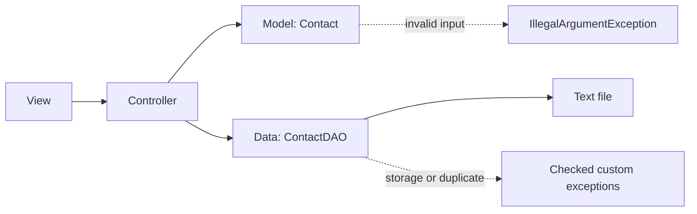

# Contact App - Exceptions Workshop

A Java/Maven workshop for building a file-backed contact application while
practising validation, checked exceptions, file I/O, and MVC.

## Current progress

Completed through **2: Custom Exceptions (Checked)**:

- Maven project and Git repository are configured.
- `Contact` validates its state with unchecked `IllegalArgumentException`s.
- `ContactStorageException` and `DuplicateContactException` are checked
  exceptions, ready for the data layer.
- Unit tests verify the validation rules.

The DAO, view, controller, `main` class, file storage, and central exception
handler are intentionally planned for later workshop sections and are not yet
implemented.

## Design

The code follows the workshop's layered MVC direction. All classes live below
the base package `se.lexicon.contactapp`; the layer packages are `model`,
`data`, `view`, `controller`, and `exception`.



### Model validation

`Contact` keeps a name and phone number. The constructor delegates to the
setters, so there is one source of truth for validation both when a contact is
created and when it is later changed.

- A name must be non-null and contain at least one non-whitespace character.
  It is stored trimmed, which avoids contacts that differ only by accidental
  surrounding spaces.
- A phone number must match `^\\d{10}$`: exactly ten digits, with no spaces,
  signs, or other characters.
- Invalid model input is a programming/input-validation issue, so
  `IllegalArgumentException` is used. It is unchecked and callers are not
  forced to catch it.

### Checked custom exceptions

The future DAO will communicate expected recoverable persistence failures
without printing to the console:

- `ContactStorageException` represents a file read/write or storage failure.
- `DuplicateContactException` represents an attempt to save an already-known
  contact.

Both extend `Exception`, making them checked. This makes the data layer's
failure paths explicit to the controller, which will decide what the user sees.

## Project layout

```text
src/
├── main/java/se/lexicon/contactapp/
│   ├── model/Contact.java
│   └── exception/
│       ├── ContactStorageException.java
│       └── DuplicateContactException.java
└── test/java/se/lexicon/contactapp/model/ContactTest.java
```

## Prerequisites verified

- Maven coordinates: `se.lexicon:contact-app-workshop:1.0-SNAPSHOT`
- Java source/target level: 21 (the locally installed JDK 26 compiles with
  `--release 21`)
- Remote: `https://github.com/FSopelsa/Exceptions_Workshop.git`
- `.gitignore` excludes IDE metadata and build output. IntelliJ's local
  `.idea` directory is deliberately not tracked.

## Run the tests

From the repository root:

```powershell
mvn clean test
```
