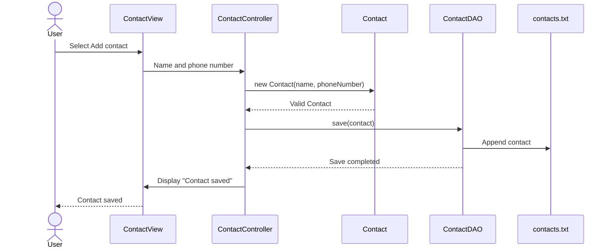

# 5: The MVC Design Pattern

MVC stands for **Model-View-Controller**. It is a design pattern that separates
an application into parts with different responsibilities. The goal is to keep
the user interface, application flow, and data logic from becoming mixed
together in the same classes.

## MVC in this contact application

### Model

The Model represents the application's data and rules. In this project,
`Contact` is the domain model. It stores a contact's name and phone number and
ensures that invalid contacts cannot be created.

The `data` package supports the Model by handling persistence:

- `ContactDAO` defines the available contact operations.
- `FileContactDAOImpl` reads and writes contacts in a text file.
- The DAO returns data or throws exceptions; it never communicates with the
  user directly.

### View

`ContactView` is responsible for everything the user sees and enters. It
displays the menu, reads input with `Scanner`, lists contacts, and prints
messages and errors. The View does not decide how contacts are validated or
stored.

### Controller

`ContactController` connects the View to the rest of the application. It reads
the user's menu choice through the View, decides which operation to perform,
creates `Contact` objects, calls the DAO, and sends results back to the View.

The Controller also owns the main `try-catch` loop. Errors from validation or
file storage are converted to suitable messages by `ExceptionHandler`, then
displayed by the View.

## Example: adding a contact

If the phone number is invalid, `Contact` throws an
`IllegalArgumentException`. If the contact already exists, the DAO throws a
`DuplicateContactException`. If the text file cannot be accessed, it throws a
`ContactStorageException`. These exceptions travel back to the Controller,
which asks the View to show an error. This keeps exception handling centralized
without making the Model or DAO print to the console.

## Why this separation is useful

- Each class has one clear responsibility.
- Validation and storage can be tested without using the console.
- File storage could later be replaced by a database implementation of
  `ContactDAO` without rewriting the View.
- The console View could later be replaced by a graphical or web interface
  without moving persistence logic.
- Changes in one layer are less likely to break unrelated parts of the program.

`Main` is not one of the three MVC parts. It is the application's starting
point and only wires the DAO, View, and Controller together before calling
`controller.run()`.
